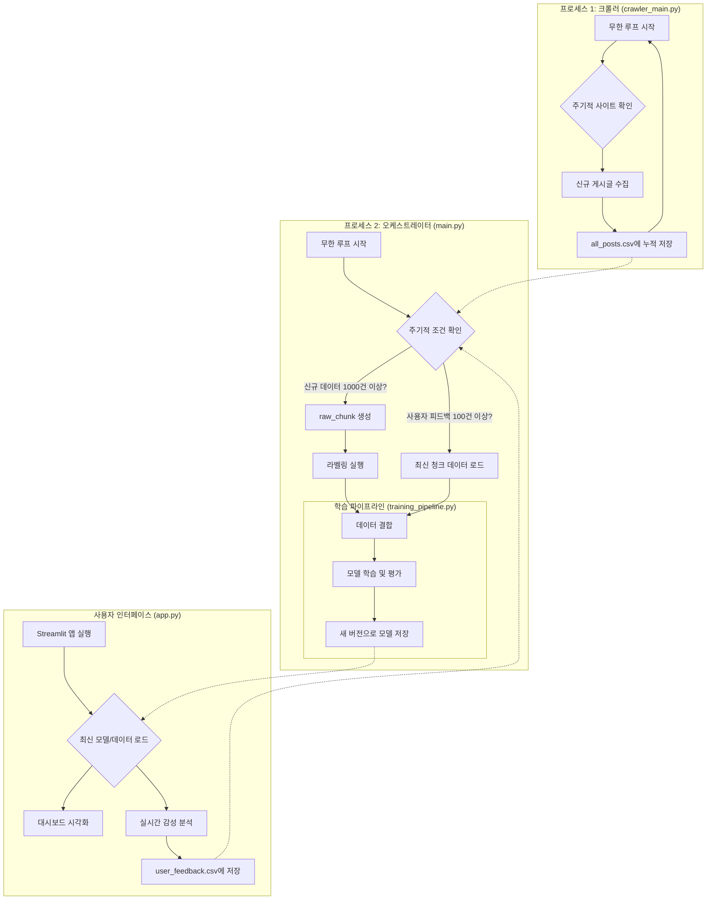

```
**터미널에서 직접 생성하는 방법:**
1.  `conda activate nlp-tfgpu` 실행 후 `pip freeze > requirements_nlp.txt`
2.  `conda activate LangchainEnv` 실행 후 `pip freeze > requirements_langchain.txt`

---

### **2. `README.md` (프로젝트 설명서)**

GitHub 리포지토리의 메인 페이지에 표시될 설명서입니다. 아래 내용을 `README.md` 파일로 저장하세요.


# MapleStory Community Sentiment Analysis MLOps Pipeline

## 1. 📖 프로젝트 개요

본 프로젝트는 메이플스토리 인벤 커뮤니티의 게시글을 기반으로, 게임 유저들의 여론 동향을 분석하는 자동화된 MLOps 파이프라인을 구축하는 것을 목표로 합니다.

단순히 모델을 한 번 학습시키는 것을 넘어, **데이터 수집, LLM을 이용한 자동 라벨링, 모델 재학습, 버전 관리, 그리고 사용자 피드백을 통한 모델 성능 개선**까지 이어지는 전체 머신러닝 생명주기를 자동화하여 지속적으로 똑똑해지는 감성 분석 시스템을 구현합니다.

---

## 2. 🌟 주요 기능

* **병렬 처리 파이프라인**: 데이터 수집 프로세스와 데이터 처리/학습 프로세스를 분리하여 24시간 멈추지 않고 동작합니다.
* **LLM 기반 자동 라벨링**: 로컬에서 실행되는 Gemma 모델(LM Studio)을 활용하여 수집된 데이터에 '긍정/중립/부정' 라벨을 자동으로 부여합니다.
* **점진적 학습 (Incremental Learning)**: 신규 데이터와 사용자 피드백, 그리고 방대한 기존 데이터를 적절히 조합하여 모델이 최신 트렌드를 반영하면서도 일반화 성능을 잃지 않도록 학습합니다.
* **모델 버전 관리**: 학습된 모델을 덮어쓰지 않고 타임스탬프 기반의 버전으로 관리하여, 언제든 이전 버전으로 롤백하거나 성능 변화를 추적할 수 있습니다.
* **인간 참여형 루프 (Human-in-the-Loop)**: Streamlit 앱을 통해 사용자가 모델의 예측 결과를 수정하고 피드백을 제출할 수 있습니다. 이 고품질 데이터는 다음 모델 학습에 반영되어 시스템의 정확도를 지속적으로 향상시킵니다.
* **인터랙티브 대시보드**: 최신 데이터를 기반으로 직업군/직업별 감성 분포와 주요 키워드를 시각화하고, 실시간으로 텍스트 감성을 분석할 수 있는 웹 애플리케이션을 제공합니다.

---

## 3. ⚙️ MLOps 아키텍처

본 파이프라인은 두 개의 독립적인 프로세스가 동시에 실행되는 병렬 구조로 설계되었습니다.



* **프로세스 1 (크롤러)**: 멈추지 않고 계속해서 메이플 인벤의 새로운 게시글을 수집하여 `all_posts.csv`에 쌓습니다.
* **프로세스 2 (오케스트레이터)**: 주기적으로 깨어나 **두 가지 조건**을 확인합니다.
    1.  새로 수집된 데이터가 1,000건 이상 쌓였는가?
    2.  사용자 피드백이 100건 이상 쌓였는가?
    * 위 조건 중 하나라도 충족되면, 데이터 라벨링과 모델 재학습 파이프라인을 실행합니다. 이 모든 과정 동안 크롤러는 영향을 받지 않고 계속 동작합니다.

---

## 4. 🗃️ 데이터 구조

| 파일/폴더명 | 설명 | 생성 주체 | 사용 주체 |
| :--- | :--- | :--- | :--- |
| `all_posts.csv` | 모든 크롤링 데이터가 누적되는 원본 파일 | `crawler_main.py` | `main.py` |
| `/raw_chunks/` | `all_posts.csv`에서 1000건 단위로 잘라낸 라벨링 대상 파일 (`raw_data_XX.csv`) | `main.py` | `labeler_main.py` |
| `/labeled_chunks/`| 라벨링이 완료된 데이터 파일 (`labeled_data_XX.csv`) | `labeler_main.py` | `training_pipeline.py`, `app.py` |
| `user_feedback.csv`| Streamlit 앱에서 사용자가 직접 입력/수정한 고품질 데이터 | `app.py` | `training_pipeline.py` |
| `/archived_feedback/`| 학습에 사용된 피드백 데이터가 백업되는 폴더 | `main.py` | - |
| `merged_label_final.csv`| (초기 데이터) 일반적인 게임 도메인 데이터. 모델의 기반 지식을 위해 사용 | 수동 | `training_pipeline.py` |
| `korean_stopwords.txt`| (초기 데이터) 한국어 불용어 사전 | 수동 | `training_pipeline.py`, `app.py` |

---

## 5. 🧠 모델 학습 방식

모델의 성능을 지속적으로 향상시키기 위해 다음과 같은 학습 전략을 사용합니다.

1.  **데이터 구성**: 재학습 시, 아래 3종류의 데이터를 모두 결합하여 사용합니다.
    * **신규 메이플 데이터**: 가장 최신 트렌드를 반영하는 데이터 (LLM 라벨링)
    * **사용자 피드백 데이터**: 사람이 직접 검증한 고품질 정답 데이터
    * **일반 게임 데이터 (샘플링)**: 모델이 메이플스토리 데이터에만 과적합되는 것을 방지하고, 게임 도메인 전반의 문맥을 이해하도록 돕는 기반 데이터. 신규 데이터와 1:1 비율로 샘플링하여 사용합니다.

2.  **모델 아키텍처**:
    * **Stacked Bi-LSTM with Dropout**: 단순한 Bi-LSTM을 넘어, 여러 층을 쌓고 각 층 사이에 Dropout을 추가하여 더 복잡한 문맥을 학습하면서도 과적합을 효과적으로 방지하는 구조를 사용합니다.

      ```
      Embedding -> Dropout -> Bi-LSTM(return_seq) -> Dropout -> Bi-LSTM -> Dense -> Dropout -> Output
      ```

---

## 6. 🚀 실행 방법

### 6.1. 환경 설정

1.  Anaconda 가상환경 2개를 생성합니다.
    ```bash
    conda create -n nlp-tfgpu python=3.9
    conda create -n LangchainEnv python=3.9
    ```
2.  각 환경을 활성화하고, 필요한 라이브러리를 설치합니다.
    ```bash
    # nlp-tfgpu 환경
    conda activate nlp-tfgpu
    pip install -r requirements_nlp.txt

    # LangchainEnv 환경
    conda activate LangchainEnv
    pip install -r requirements_langchain.txt
    ```
3.  Konlpy(Okt) 사용을 위해 JDK 설치가 필요할 수 있습니다.

### 6.2. 초기 모델 학습 (최초 1회)

1.  `data` 폴더에 `merged_label_final.csv` 와 `korean_stopwords.txt` 파일을 위치시킵니다.
2.  `training_pipeline.py`를 직접 실행하여 초기 베이스 모델을 생성합니다.
    ```bash
    conda activate nlp-tfgpu
    # 인자로 초기 데이터를 임시로 전달하여 실행
    python training_pipeline.py ./data/merged_label_final.csv
    ```
    * 실행이 완료되면 `production_models/` 폴더에 첫 버전의 모델이 생성됩니다.

### 6.3. 파이프라인 실행

1.  LM Studio를 실행하고, 감성 분석에 사용할 모델(예: `google/gemma-2-9b-it`)을 로컬 서버로 실행합니다.
2.  **터미널 1**에서 MLOps 파이프라인을 시작합니다.
    ```bash
    conda activate nlp-tfgpu # 또는 main.py가 있는 환경
    python main.py
    ```
    * 이제 크롤러와 오케스트레이터가 동시에 실행되며 자동화 파이프라인이 시작됩니다.

3.  **터미널 2**에서 사용자용 대시보드 앱을 실행합니다.
    ```bash
    conda activate nlp-tfgpu
    streamlit run app.py
    ```
    * 웹 브라우저에서 `http://localhost:8501` 주소로 접속하여 대시보드를 확인합
